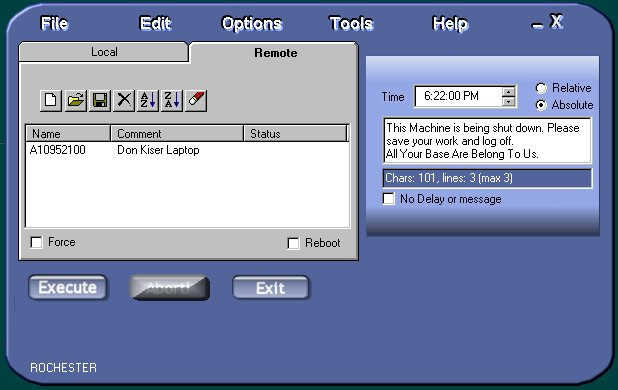

<div align="center">

## Remote Shutdown Agent


</div>

### Description

This application will allow an NT Administrator to remotely shutdown a NT workstation for which they are a member of its local adminstrator group * You can shutdown two ways one that is absolute (5:00 PM) or delayed (10 minutes from now) * A shutdown message can be displayed * A forced immediate shutdown can be implemented (user gets no warning) * Running applications on client can be allowed to close or terminated immediately * Time delayed remote shutdowns can be aborted for any or all computers on list * Note for Win 95/98 users: Remote shutdowns are not allowed through Win 95/98 machines. XP/2000 is untested. There's alot of code in here and its relatively well commented but there may be redundant API declartions, etc. The code has been tested and works. I haven't test cross-domain shutdowns however. Use this program at your own risk. Author assumes no liability for its use or misuse. There's alot to this code, have fun.
 
### More Info
 
Unzip using supplied folders

Register the CCRP Time/Date Picker Control (included)


<span>             |<span>
---                |---
**Submitted On**   |2002-01-02 07:43:50
**By**             |[Dki](https://github.com/Planet-Source-Code/PSCIndex/blob/master/ByAuthor/dki.md)
**Level**          |Advanced
**User Rating**    |5.0 (10 globes from 2 users)
**Compatibility**  |VB 6\.0
**Category**       |[Complete Applications](https://github.com/Planet-Source-Code/PSCIndex/blob/master/ByCategory/complete-applications__1-27.md)
**World**          |[Visual Basic](https://github.com/Planet-Source-Code/PSCIndex/blob/master/ByWorld/visual-basic.md)
**Archive File**   |[Remote\_Shu45725122002\.zip](https://github.com/Planet-Source-Code/dki-remote-shutdown-agent__1-30172/archive/master.zip)

### API Declarations

```
*****UPDATE***** 1/2/01
The batch files have been removed. Thanks to Morgan Haueisen for the suggestion for enumerating domains.
The program requires the Active Directory Service Interface v2.5
It can be downloaded from:
http://www.microsoft.com/NTWorkstation/downloads/Other/ADSI25.asp
Changes:
ADSI is used to enumerate domains
API calls are used to enumerate machines on a domain and the comment field.
```


